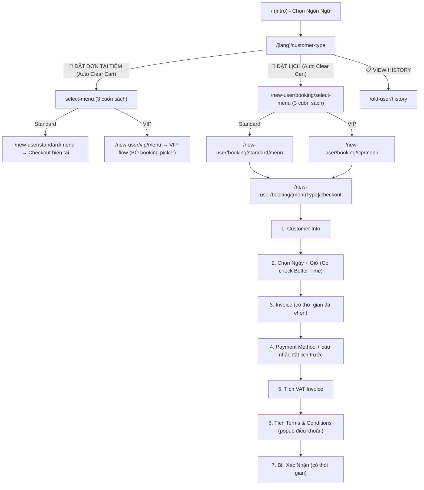

# Plan: Tách Luồng "Đặt Tại Tiệm" vs "Đặt Lịch" — Hướng B (Cập Nhật Sau Phản Biện)

> **Trạng thái**: ✅ Đã duyệt & Cập nhật phản biện AI  
> **Ngày tạo**: 2026-06-14 (Cập nhật 2026-06-15)  
> **Dự kiến thực hiện**: 2-3 ngày làm việc  
> **Project**: wrb-noi-bo-dev (Web Nội Bộ Ngân Hà Spa)

---

## Tóm Tắt Yêu Cầu

Thêm tính năng **Đặt lịch (Advance Booking)** với folder route mới `/[lang]/new-user/booking/`, tách biệt hoàn toàn khỏi luồng walk-in hiện tại.

### Thay đổi chính:
1. **Customer-type page**: Xoá nút "NEW ORDER" → Thay bằng 2 nút: "Đặt đơn tại tiệm" + "Đặt lịch". **Bổ sung:** Reset giỏ hàng khi chọn luồng.
2. **VIP menu & Standard Menu**: Dùng chung Component UI, phân biệt luồng bằng prop `isBookingFlow` (kiểm tra qua URL path, KHÔNG dùng sessionStorage). Ở VIP menu, bỏ 2 nút chọn "tại tiệm / đặt lịch" trong BookingConfig nếu ở luồng booking.
3. **Booking flow mới**: Folder `/booking/` riêng với checkout có Date/Time Picker (có chặn giờ quá khứ), Payment, VAT, Terms & Conditions
4. **HomeSpa**: Vẫn Coming Soon trong cả 2 luồng

---

## Bản Đồ Luồng Mới



---

## Cấu Trúc Folder Mới

```
src/app/[lang]/new-user/booking/
├── select-menu/
│   └── page.tsx              ← [NEW] Reuse MenuTypeSelector component
├── [menuType]/
│   ├── menu/
│   │   └── page.tsx          ← [NEW] Gọi component Standard/Premium với isBookingFlow={true}
│   └── checkout/
│       └── page.tsx          ← [NEW] ⭐ Booking Checkout (trọng tâm)

src/components/Booking/
├── BookingTimePicker.tsx      ← [NEW] Reuse FlipTimePicker + chặn giờ quá khứ
├── BookingCheckout.i18n.ts    ← [NEW] i18n 5 ngôn ngữ
├── BookingTermsModal.tsx      ← [NEW] Popup điều khoản
└── BookingConfirmModal.tsx    ← [NEW] Bill xác nhận (extend OrderConfirmModal)
```

---

## Chi Tiết Thay Đổi Theo Phase

### Phase 1: Customer-Type Page (Màn Welcome) — ~1.5 giờ

| File | Hành động | Mô tả |
|------|-----------|-------|
| `src/app/[lang]/customer-type/page.tsx` | MODIFY | Xoá "NEW ORDER" → 2 nút mới. Giữ nút VIEW HISTORY |
| `src/app/[lang]/customer-type/CustomerType.logic.ts` | MODIFY | Thêm `onSelectWalkIn()` + `onSelectAdvance()`. Bắt buộc gọi `clearCart()` |
| `src/app/[lang]/customer-type/CustomerType.i18n.ts` | MODIFY | Thêm key dịch 5 ngôn ngữ cho 2 nút mới |

### Phase 2: Booking Route + Checkout Page — ~6-8 giờ ⭐

| File | Hành động | Mô tả |
|------|-----------|-------|
| `src/app/[lang]/new-user/booking/select-menu/page.tsx` | NEW | Clone select-menu, navigate đến `/booking/[type]/menu` |
| `src/app/[lang]/new-user/booking/[menuType]/menu/page.tsx` | NEW | Tái sử dụng `StandardMenu` và `PremiumMenu` bằng cách cắm prop `isBookingFlow={true}` |
| `src/app/[lang]/new-user/booking/[menuType]/checkout/page.tsx` | NEW | ⭐ Booking Checkout mới với 7 bước |
| `src/components/Booking/BookingTimePicker.tsx` | NEW | Extract từ VIP BookingConfig, thêm logic cấm giờ quá khứ/quá sát (+30 phút buffer) |
| `src/components/Booking/BookingCheckout.i18n.ts` | NEW | i18n 5 ngôn ngữ cho checkout + câu nhắc |
| `src/components/Booking/BookingTermsModal.tsx` | NEW | Popup điều khoản |
| `src/components/Booking/BookingConfirmModal.tsx` | NEW | Bill xác nhận có ngày/giờ |

### Phase 3: Sửa VIP Flow & Standard Menu — ~2-3 giờ

| File | Hành động | Mô tả |
|------|-----------|-------|
| `src/components/Menu/Premium/BookingConfig/index.tsx` | MODIFY | Xoá section "Hình Thức Sử Dụng". Đọc `isBookingFlow` từ prop thay vì sessionStorage |
| `src/components/Menu/Premium/index.tsx` | MODIFY | Nhận `isBookingFlow` prop và truyền xuống |
| `src/components/Menu/Standard/index.tsx` | MODIFY | Nhận `isBookingFlow` prop, chỉnh sửa hành vi navigate của CartDrawer (qua checkout thường hay booking checkout) |

### Phase 4: Testing + Bug Fix + Go-live — ~3-4 giờ

*(Cùng các Test Cases như trước, bổ sung thêm việc test Giờ chặn trong FlipTimePicker và test URL thay vì sessionStorage)*

---

## Quyết Định Kỹ Thuật (Đã Cập Nhật Theo AI Sparring)

| Quyết định | Kết quả |
|------------|---------|
| Hướng tiếp cận | **Hướng B** — Folder route mới `/booking/` |
| Quản lý Intent | **URL Path** — Bỏ sessionStorage, dùng URL làm source of truth |
| Validation Giờ | **Có Buffer Time** — Chặn giờ quá khứ và giờ quá sát hiện tại |
| Quản lý Giỏ Hàng | **Clear Cart** — Auto reset giỏ khi đổi luồng ở màn hình chọn |
| Code UI Menu | **DRY Principle** — Truyền prop `isBookingFlow` thay vì copy component |
